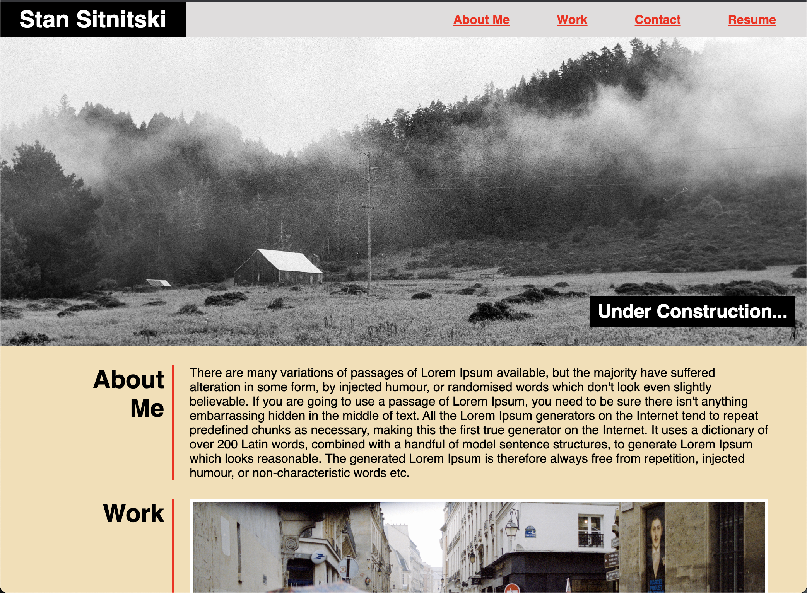

# Professional-Portfolio / Stan Sitnitski

## Description

This is my professional portfolio where I'll be modifying and adding new content as I progress as a web developer. So under construction it is...

This project took me some time to materialize and there is still a lot to improve (image sizes will be made smaller next time) but it did help me to understand the use of flaxboxes HTML/CSS in paractice. I hope this process of web development will become easier and faster as time goes by. 

## Usage

User can find deployed app at [Professional-Portfolio](https://rroip.github.io/Professional-Portfolio/)

Repo for app can be found at https://github.com/rroip/Professional-Portfolio
